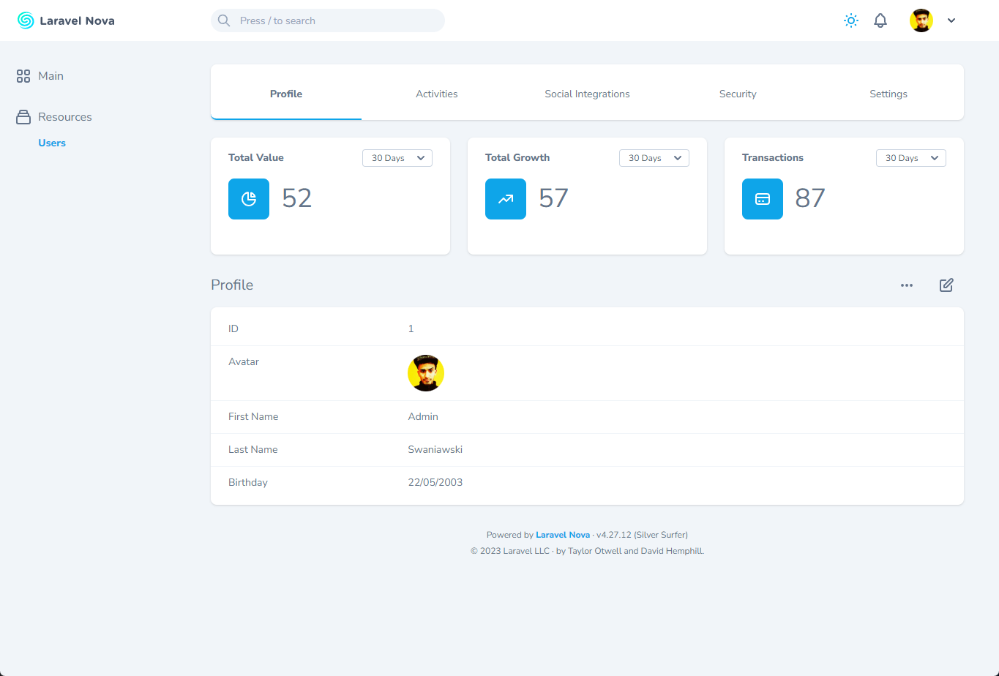

# Resource Navigation Tab

[](https://packagist.org/packages/digital-creative/resource-navigation-tab)
[](https://packagist.org/packages/digital-creative/resource-navigation-tab)
[](https://github.com/dcasia/resource-navigation-tab/blob/master/LICENSE)

Organize your resource fields into tabs.

<picture>
  <source media="(prefers-color-scheme: dark)" srcset="./screenshots/dark/demo-2.png">
  
</picture>

# Installation

You can install the package via composer:

```shell
composer require digital-creative/resource-navigation-tab
```

## Basic Usage

First, import `HasResourceNavigationTabTrait` trait into your resource and start grouping your fields with
the `ResourceNavigationField` object:

```php
use DigitalCreative\ResourceNavigationTab\HasResourceNavigationTabTrait;
use DigitalCreative\ResourceNavigationTab\ResourceNavigationField;

class ExampleNovaResource extends Resource {
 
    use HasResourceNavigationTabTrait;

    public function fields(NovaRequest $request): array
    {
        return [
            ResourceNavigationField::make('Information')
                ->fields([
                    Text::make('Name'),
                    Text::make('Age'),
                    HasMany::make('Hobbies'),
                ]),
            ResourceNavigationField::make('Activities')->fields([ ... ]),
            ResourceNavigationField::make('Social Interactions')->fields([ ... ]),
            ResourceNavigationField::make('Settings')->fields([ ... ]),
        ];
    }

}
```

Once setup navigate to your resource detail view, and you should be presented with this card:

<picture>
  <source media="(prefers-color-scheme: dark)" srcset="./screenshots/dark/demo-1.png">
  
</picture>

Every defined card will be shown on every tab by default, however you can choose which card you want to show when a
specific tab is selected:

```php
use DigitalCreative\ResourceNavigationTab\HasResourceNavigationTabTrait;
use DigitalCreative\ResourceNavigationTab\ResourceNavigationField;
use DigitalCreative\ResourceNavigationTab\CardMode;

class ExampleNovaResource extends Resource {

    use HasResourceNavigationTabTrait;
 
    public function fields(NovaRequest $request): array
    {
        return [
            ResourceNavigationField::make('Information'), // show all the available cards by default
            ResourceNavigationField::make('Activities')->withCards([ DailySalesCard::class, ClientProfileCard::class ]), // only show these cards when this tab is active
            ResourceNavigationField::make('Settings')->withoutCards([ ... ]), // hide all cards when this tab is active
        ];
    }

    public function cards(NovaRequest $request): array
    {
        return [
            new ClientPerformanceCard(),
            new DailySalesCard(),
            new ClientProfileCard()
        ];
    }

}
```

## License

The MIT License (MIT). Please see [License File](./LICENSE) for more information.
